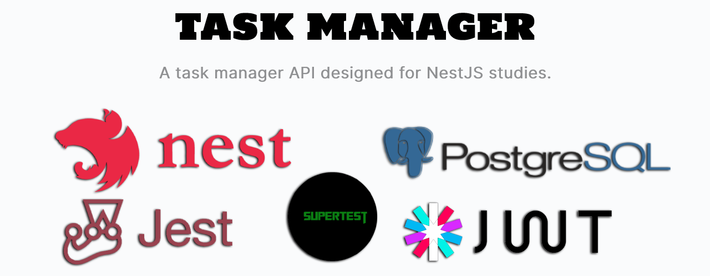
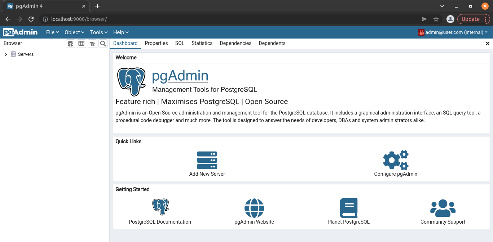

<div align='justify'>



> A task manager API designed for studies. Developed with NestJS, PostgreSQL, Jest, Supertest, JWT and Docker.

<br>

## **Techs**

- [NestJS](https://docs.nestjs.com/)
- [PostgreSQL](https://www.postgresql.org/)
- [TypeORM](https://typeorm.io)
- [Json Web Token](https://jwt.io/)
- [Docker](https://www.docker.com/)
- [Passport](http://www.passportjs.org/)
- [Insomnia](https://insomnia.rest/)

<br>

## **Run**

```bash
docker-compose --env-file ./.env.dev up --build -d
```

- You can use the Insomnia Collection provided in this directory [./insomnia-collection.json](./insomnia-collection.json).
- After running, you can acess the **PgAdmin** http://localhost:9000/browser and use the login credentials, provided in [.env.dev](./.env.dev) file.



<br>

## **References**

- [NestJS - Zero to Hero](https://www.udemy.com/course/nestjs-zero-to-hero/?utm_source=adwords&utm_medium=udemyads&utm_campaign=WebDevelopment_v.PROF_la.EN_cc.BR_ti.8322&utm_content=deal4584&utm_term=_._ag_108455848694_._ad_467154447027_._kw__._de_c_._dm__._pl__._ti_dsa-774930035449_._li_9100507_._pd__._&matchtype=&gclid=EAIaIQobChMIyOqbvu_79gIVwgqRCh1SrgtnEAAYASAAEgLfwfD_BwE)


</div>
